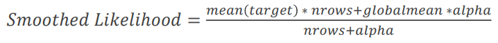
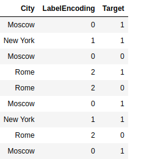
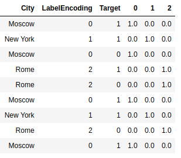
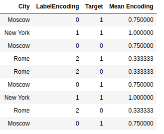
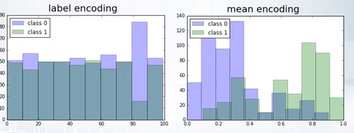
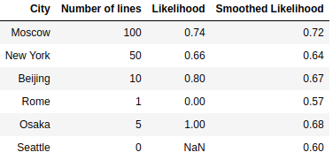

This package gives the opportunity to use a Target mean Encoding.

TargetEncoder - The algorithm encodes all features that are submitted to the
input based on the target.

Parameters:

    alpha (float): smoothing parameter for generalization.



    max_bins (int): maximum number of unique values in a feature.
    split (tuple[Union[int, BaseCrossValidator]): tuple of int or
        cross-validator classes.

        If split len is 0, then algorithm
        will encode features without cross-validation.
        This situation features will over-fit on target.

        If split len is 1, algorithm will encode features by using
        cross-validation on folds.
        In this situation you will not over-fit on tests,
        but when you will validate, your score may over-fit.

        If split len is 2, algorithm will separate data on first folds,
        afterwords will encode features by using cross-validation
        on second folds. This situation is the best way to
        avoid over-fit, but algorithm will use small data for encode.

---

TargetEncoderRegressor - The algorithm encodes all feature and then takes the
average of encoded features as prediction.

    alpha (float): smoothing parameter for generalization.
    max_bins (int): maximum number of unique values in a feature.
    used_features (int): Number of used features for prediction.
        Value has to be between 1 and number of features.

---

TargetEncoderClassifier - The algorithm encodes all feature and then takes the
average of encoded features as probability.

    alpha (float): smoothing parameter for generalization.
    max_bins (int): maximum number of unique values in a feature.
    used_features (int): Number of used features for prediction.
        Value has to be between 1 and number of features.

---
Categorical features can be encoded in several ways. The first method is to
encode just numbers from 0 to n-1, where n is the number of unique values. Such
an encoding is called LabelEncoding.



Here we coded
"Moscow": 0,
"New York": 1,
"Rome": 2

Another encoding method is called OneHotEncoding. Here we create instead of a
single feature n features, where n is the number of unique values. Where for
each object we put 0 everywhere except for the k-th element, where there is 1.



Another method of encoding categorical features is used here - encoding by the
average value of the target.



Average encoding is better than LabelEncoding, because a histogram of
predictions using label & mean encoding show that mean encoding tend to group
the classes together whereas the grouping is random in case of LabelEncoding.



___

Consider next example, here is a table with information about the categories in
the data. It can be seen that there are several categories, the number of which
is very small, or did not occur in the dataset. Such data can interfere with the
model, and this data can be retrained. As you can see Rome was presented only
once and its target was 0, then whenever we encode Rome we will replace it with
0. That's the problem, our algorithm will be retrained. To avoid this, we will
use smoothing.




As you can see, we were able to solve the problem with small classes, their
encodings have become more smoothed and shifted to the mean values.

___

Next we will be able to encode Train dataset and Test dataset.

In order to avoid over-fitting, we have to use the Folds split when encoding on
the Train, and if we use validation that would on validation also not to retrain
we inside each Fold have to do another split on the Folds.

For Test dataset, we use all the data from Train dataset for encoding.


___

Once we have coded average, there are 3 uses for these features.

1. Train the model on our new data.
2. Train the model on our new and old data.
3. Take the average of the new data and use it as a prediction.

The "experiments" folder contains the results of comparing these methods.
___

Example of usage

```python
"""Example of usage"""

from sklearn.datasets import load_breast_cancer
from sklearn.model_selection import train_test_split
from sklearn.ensemble import RandomForestClassifier
from sklearn.metrics import roc_auc_score

from target_encoding import TargetEncoderClassifier
from target_encoding import TargetEncoder

X, y = load_breast_cancer(return_X_y=True)
X_train, X_test, y_train, y_test = train_test_split(
    X,
    y,
    test_size=0.2,
    random_state=42,
)

enc = TargetEncoder()
new_X_train = enc.transform_train(X_train, y_train)
new_X_test = enc.transform_test(X_test)

rf = RandomForestClassifier(n_estimators=100, random_state=42)
rf.fit(X_train, y_train)
pred = rf.predict_proba(X_test)[:, 1]
print(f'without target encoding {roc_auc_score(y_test, pred):.4f}')

rf.fit(new_X_train, y_train)
pred = rf.predict_proba(new_X_test)[:, 1]
print(f'with target encoding {roc_auc_score(y_test, pred):.4f}')

enc = TargetEncoderClassifier()
enc.fit(X_train, y_train)
pred = enc.predict_proba(X_test)[:, 1]
print(f'target encoding classifier {roc_auc_score(y_test, pred):.4f}')

```

```
without target encoding 0.9953
with target encoding 0.9993
target encoding classifier 0.9974

```

___
You can install it by using pip

```
pip install target_encoding
```

___

```
Requirements:
    numpy>=1.16.2
    scikit-learn>=0.20.3
    pandas>=1.1.0
```