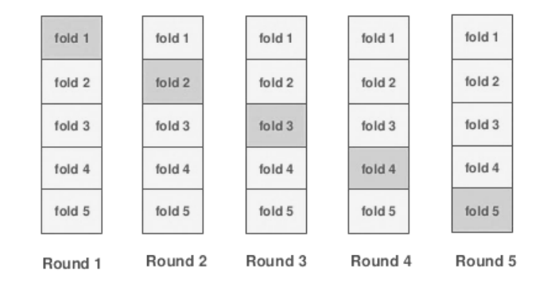

This package gives you the opportunity to use a Target mean Encoding.

Categorical features can be encoded in several ways. The first method is to encode just numbers from 0 to n-1, where n is the number of unique values. Such an encoding is called LabelEncoding.


Here we coded
"Moscow": 0,
"New York": 1,
"Rome": 2

Another encoding method is called OneHotEncoding. Here we create instead of a single feature n features, where n is the number of unique values. Where for each object we put 0 everywhere except for the k-th element, where there is 1.


Another method of encoding categorical features is used here - encoding by the average value of the target.


Average encoding is better than LabelEncoding, because a histogram of predictions using label & mean encoding show that mean encoding tend to group the classes together whereas the grouping is random in case of LabelEncoding.


___

Consider next example, here is a table with information about the categories in the data. It can be seen that there are several categories, the number of which is very small, or did not occur in the dataset. Such data can interfere with the model, and this data can be retrained. As you can see Rome was presented only once and its target was 0, then whenever we encode Rome we will replace it with 0. And that's the problem, our algorithm will be retrained. To avoid this, we will use smoothing.


As you can see, we were able to solve the problem with small classes, their encodings have become more smoothed and shifted to the mean values.

___

Next we will be able to encode Train dataset and Test dataset.

In order to avoid overfitting, we have to use the Folds split when encoding on the Train, and if we use validation that would on validation also not to retrain we inside each Fold have to do another split on the Folds.
And for Test dataset, we use all the data from Train dataset for encoding.



___

Once we have coded average, there are 3 uses for these features. 
1. Train the model on our new data.
2. Train the model on our new and old data.
3. Take the average of the new data and use it as a prediction.

In the folder "experiments" have the results from the comparison of these methods.

___

Example of usage
```python
from target_encoding import TargetEncoderClassifier
from target_encoding import TargetEncoder

from sklearn.datasets import load_breast_cancer
from sklearn.model_selection import train_test_split
from sklearn.ensemble import RandomForestClassifier
from sklearn.metrics import roc_auc_score


X, y = load_breast_cancer(return_X_y=True)
X_train, X_test, y_train, y_test = train_test_split(X, y, test_size=0.2, random_state=42)

enc = TargetEncoder()
new_X_train = enc.transform_train(X=X_train, y=y_train)
new_X_test = enc.transform_test(X_test)

rf = RandomForestClassifier(n_estimators=100, random_state=42)
rf.fit(X_train, y_train)
pred = rf.predict_proba(X_test)[:,1]
print('without target encoding', roc_auc_score(y_test, pred))

rf.fit(new_X_train, y_train)
pred = rf.predict_proba(new_X_test)[:,1]
print('with target encoding', roc_auc_score(y_test, pred))

enc = TargetEncoderClassifier()
enc.fit(X_train, y_train)
pred = enc.predict_proba(X_test)[:,1]
print('target encoding classifier', roc_auc_score(y_test, pred))
```
```
without target encoding 0.9952505732066819
with target encoding 0.996560759908287
target encoding classifier 0.9973796265967901

```

___
You can install it by using pip
```
pip install target_encoding
```

___
```
Requirements:
    numpy==1.16.2
    scikit-learn==0.20.3
```